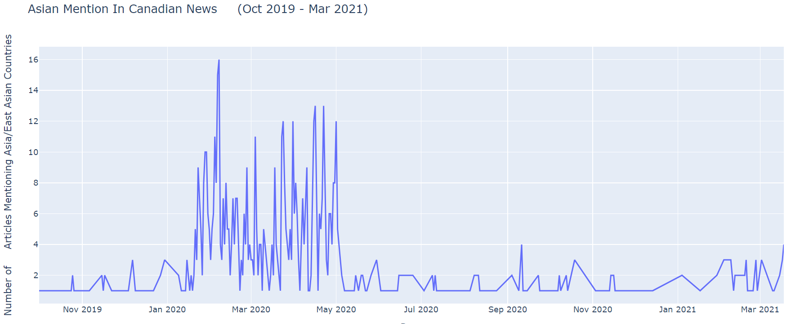

# Graphical Display of East-Asian Mention in Media

This is an object-oriented project which utilizes `TKinter` and the `plotly` library to demonstrate the appearances of East-Asian mention in media headlines during the peak of the COVID-19 pandemic and compares them to the number of COVID-19 cases at the time, as well as relevant significant events.

## How to Run the Program

To start the program, run the "main.py" file. Upon launching the program, the main screen with 5 buttons will appear. Each button describes a graph format and the information it displays.

The first button leads to a line graph displaying the appearances of East-Asian mention in Canadian news headlines.

The next button shows the same graph in histogram form.

The third graph is a line graph of the number of daily COVID-19 cases throughout the pandemic.

The fourth is a histogram displaying the same information.

The last graph shows a stacked line graph comparing the two, and also highlights the dates of relevant significant events occuring throughout.

